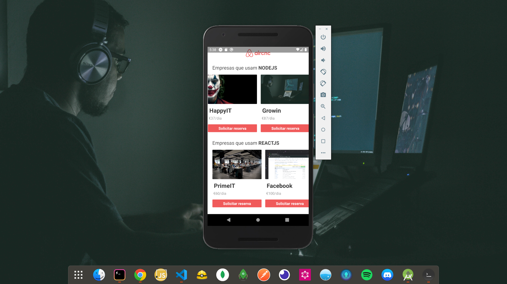

# Aircnc (Mobile w/ React Native)



This is the frontend mobile version of Aircnc, focused on the developer side. Allows Developers to login by typing in the email and technologies they are interested in. This redirects them to the application's homepage where they can see all the spots filtered by the user's technologies of entry, thus making it possible to make the Booking request of the spot.

## Getting Started

These instructions will get you a copy of the project up and running on your local machine (Real mobile device or simulator) for development and testing purposes. Feel free to deploy if you want.

### Prerequisites

You will need the [backend](https://github.com/nubelsondev/aircnc-backend) to be running so that you can connect both sides of the Application.

**Note: In your Axios set up to connect the mobile app to the backend, you need to change localhost to LAN URL provided by Expo Development Tool.**

```javascript
/*
Expo developer Tool
$ http://localhost:19002/

Connection LAN url
$ exp://192.168.1.9:19000 => change Axios baseUrl localhost by 192.168.1.9
*/
```


### Installation

Clone the repository and run

```javascript
// With NPM
$ npm install
$ npm run start

// With Yarn
$ yarn install
$ yarn start
```

## Built With

-   [React Native](https://facebook.github.io/react-native/)
-   [React-Navigation](https://reactnavigation.org/)
-   [Axios](https://github.com/axios/axios)
-   [Expo](https://expo.io/)

## Contributing

Please feel free to send pull request if you want to contribute!

## Authors

-Nubelson - _Development_ - [nubelsondev](https://github.com/nubelsondev)
